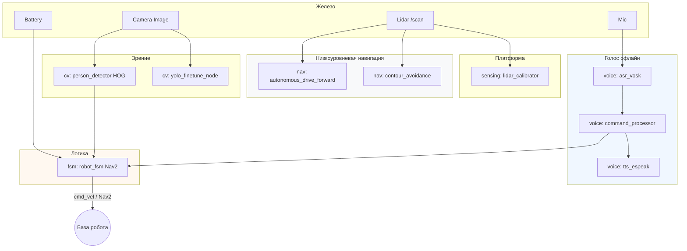
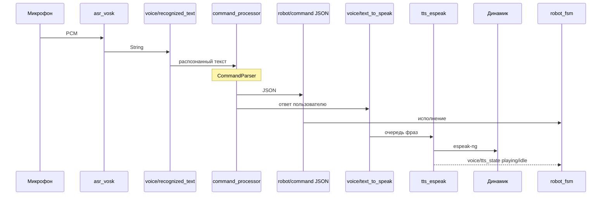
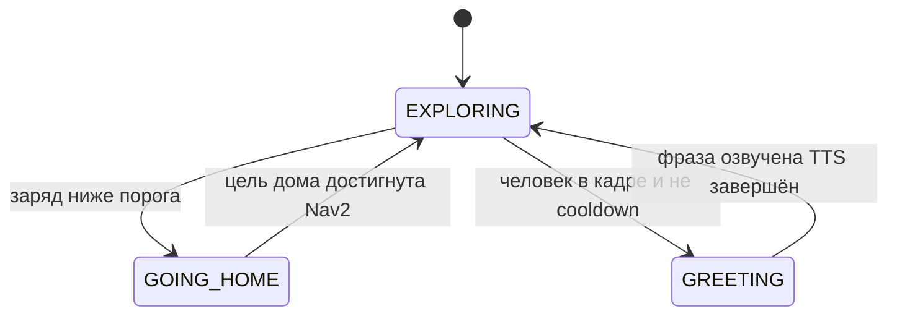

# Hackathon ROS 2 — робот: лидара, объезд, зрение, голос, FSM

Один пакет **`hackathon_robot`** для хакатона: сенсоры, низкоуровневое движение, YOLO-датасет, HOG, офлайн-голос (Vosk + espeak-ng), центральный конечный автомат и Nav2.

---

## Оглавление

1. [Удобно ли открывать на других устройствах?](#1-удобно-ли-открывать-на-других-устройствах)  
2. [Общая схема системы](#2-общая-схема-системы)  
3. [Голосовой контур (офлайн)](#3-голосовой-контур-офлайн)  
4. [FSM и приоритеты](#4-fsm-и-приоритеты)  
5. [Роли команды и папки](#5-роли-команды-и-папки)  
6. [Быстрый старт](#6-быстрый-старт)  
7. [Ноды и команды](#7-ноды-и-команды)  
8. [Лидар · Объезд · YOLO](#8-лидар--объезд--yolo)  
9. [Дерево репозитория](#9-дерево-репозитория)  
10. [Чеклист на день соревнования](#10-чеклист-на-день-соревнования)

---

## 1. Удобно ли открывать на других устройствах?

В целом **да**, если это «ещё один компьютер с тем же ROS 2». Репозиторий рассчитан на классический сценарий: **клонировать → положить в `ros2_ws/src` → `colcon build` → `source install/setup.bash`**.

| Что переносится без боли | На что обратить внимание на новой машине |
|--------------------------|------------------------------------------|
| Исходники Python, `package.xml`, `launch/` | **Дистрибутив ROS 2** (Humble / Jazzy и т.д.) должен совпадать или пакеты должны собираться без изменений под ваш |
| Зависимости через `pip` / `rosdep` | **Vosk**: модель качается **отдельно**, путь задаётся параметром (не лежит в git). **espeak-ng** ставится в систему и может отличаться на Windows/Linux |
| Относительные пути внутри пакета | **`params/lidar_calibration.yaml`** создаётся от **текущей рабочей директории** при запуске ноды лидара — на другом ПК нужно снова откалибровать или **скопировать файл** в ту же относительную структуру `params/` |
| Запуск через `ros2 run` / `ros2 launch` | Топики робота (`/scan`, камера, `/icp/odom`, Nav2) на новом железе почти всегда нужно **сопоставить параметрами или remap в launch** |

Итого: **открыть и собрать код** удобно; **«завести робота»** на новом устройстве всегда означает переустановить системные зависимости, модель Vosk и один раз проверить топики.

---

## 2. Общая схема системы

Поток данных и зоны ответственности в одном рисунке:



Важно: **`robot_fsm`** и ноды **`autonomous_drive_*`** оба могут слать **`/cmd_vel`**. На роботе должен работать **один** основной контур движения (см. раздел про объезд ниже).

---

## 3. Голосовой контур (офлайн)

По идее учебника (ASR → NLP → команда → TTS), но **без облака**: распознавание — **Vosk**, синтез — **espeak-ng**.



Имитация без микрофона (организаторы часто шлют строку в топик):

```bash
ros2 topic pub --once /voice_cmd std_msgs/msg/String "data: 'робот найди синий куб'"
```

---

## 4. FSM и приоритеты

Логика **`robot_fsm_node`**: решения в **таймере ~10 Гц**; в коллбэках — только обновление флагов и данных.



Приоритет проверок в диспетчере: **батарея → приветствие → исследование** (как в занятии 19).

---

## 5. Роли команды и папки

Маппинг на типичные роли хакатона (занятие 19):

| Роль | Папка в пакете | Главные файлы |
|------|----------------|---------------|
| Архитектор FSM | `hackathon_robot/fsm_architect/` | `robot_fsm_node.py` |
| CV | `hackathon_robot/cv_engineer/` | `person_detector_node.py`, `yolo_finetune_node.py` |
| Nav | `hackathon_robot/nav_engineer/` | `autonomous_drive_forward.py`, `contour_avoidance.py` |
| Платформа / сенсоры | `hackathon_robot/sensing/` | `lidar_calibrator.py` |
| Голос | `hackathon_robot/voice/` | `asr_vosk_node.py`, `tts_espeak_node.py`, `command_processor_node.py`, `command_parser.py` |
| Интегратор | `hackathon_robot/launch/`, `config/` | `voice_stack.launch.py`, `bringup_voice_fsm.launch.py` |

В корне репозитория также лежат архивные **`.txt`** с тем же кодом, что был до упаковки в пакет (`moving.txt`, `new_mover.txt`, `lidar_colibrovka.txt`).

---

## 6. Быстрый старт

Репозиторий кладётся в воркспейс ROS 2:

```text
ros2_ws/src/hackathon_robot/   ← содержимое каталога hackathon_robot из этого git-проекта
```

Зависимости ROS (через дистрибутив): **`rclpy`**, сообщения геометрии/навигации, **`nav2_msgs`**, **`tf2_ros`**, **`cv_bridge`**, **`std_srvs`**, **`action_msgs`**.

Python (минимум):

```bash
pip install opencv-python-headless vosk sounddevice ultralytics
```

Сборка и окружение:

```bash
cd ros2_ws
colcon build --packages-select hackathon_robot
source install/setup.bash
```

Дополнительно:

- **espeak-ng**: [репозиторий проекта](https://github.com/espeak-ng/espeak-ng) (Linux: `sudo apt install espeak-ng`).
- **Модель Vosk (RU)**: [alphacephei.com/vosk/models](https://alphacephei.com/vosk/models) — скачать и распаковать, путь передать в launch.

Опционально extras из `setup.py`:

```bash
cd ros2_ws/src/hackathon_robot && pip install ".[voice]"
```

---

## 7. Ноды и команды

| Команда | Назначение |
|---------|------------|
| `ros2 run hackathon_robot lidar_calibrator` | Калибровка лидара, TF, `/obstacle_detected`, `/front_distance` |
| `ros2 run hackathon_robot autonomous_drive_forward` | Вперёд + объезд по `/scan` |
| `ros2 run hackathon_robot contour_avoidance` | Объезд контура (альтернативная логика) |
| `ros2 run hackathon_robot yolo_finetune_node` | Сохранение кадров для дообучения YOLO |
| `ros2 run hackathon_robot person_detector` | HOG → `/person_detected`, `/person_offset_x` |
| `ros2 run hackathon_robot robot_fsm` | FSM + Nav2 + команды `robot/command` |
| `ros2 run hackathon_robot tts_espeak` | Очередь → espeak-ng, статус `voice/tts_state` |
| `ros2 run hackathon_robot asr_vosk` | Vosk → `voice/recognized_text` |
| `ros2 run hackathon_robot voice_command_processor` | Парсер → `robot/command` + ответ в TTS |

**Launch:**

```bash
ros2 launch hackathon_robot voice_stack.launch.py vosk_model_path:=/ABS/PATH/vosk-model-small-ru-0.22
ros2 launch hackathon_robot bringup_voice_fsm.launch.py vosk_model_path:=/ABS/PATH/vosk-model-small-ru-0.22 camera_topic:=/camera_node/image_raw
```

На **`bringup_voice_fsm`** не входят SLAM и Nav2 целиком — их поднимает интегратор на роботе или в симуляции.

---

## 8. Лидар · Объезд · YOLO

**Лидар.** Запускать из каталога, где хотите видеть `params/lidar_calibration.yaml` (файл создаётся относительно текущей рабочей директории процесса). Интерактивный Enter для старта калибровки.

**Объезд.** Калибровка обязательна для нод «вперёд». Имена ROS-нод в коде объезда совпадают (`autonomous_drive`) — **не запускайте обе ноды объезда одновременно**. Не смешивайте **`robot_fsm`** с этими нодами, если все пишут в один **`/cmd_vel`**.

**YOLO.** Нода только пишет JPEG и предлагает сервис захвата; разметка и `yolo train` — офлайн. Пример `data.yaml`: `hackathon_robot/config/yolo_data.example.yaml`.

---

## 9. Дерево репозитория

```text
development_on_ros2/
  README.md                 ← вы здесь
  .gitignore
  *.txt                     архивные копии скриптов (до пакета)
  hackathon_robot/          ROS 2 пакет ament_python
    package.xml
    setup.py
    setup.cfg
    resource/hackathon_robot
    launch/
      voice_stack.launch.py
      bringup_voice_fsm.launch.py
    config/
      yolo_data.example.yaml
    hackathon_robot/
      voice/
      fsm_architect/
      cv_engineer/
      nav_engineer/
      sensing/
```

---

## 10. Чеклист на день соревнования

- [ ] На машине команды: установлен ROS 2, собран пакет, `source install/setup.bash`.
- [ ] Проверены топики: `ros2 topic list`, камера и лидара на ожидаемых именах.
- [ ] Nav2 и карта запускаются интегратором; action `navigate_to_pose` виден.
- [ ] Лидар откалиброван, `params/lidar_calibration.yaml` на месте для выбранного сценария.
- [ ] Выбран **один** режим движения: **либо** FSM+Nav2, **либо** низкоуровневый объезд.
- [ ] Голос: модель Vosk на диске, espeak-ng ставит звук; есть запасной тест через `/voice_cmd`.
- [ ] Для vision: при необходимости датасет и веса YOLO собраны заранее.

Удачи на хакатоне.
